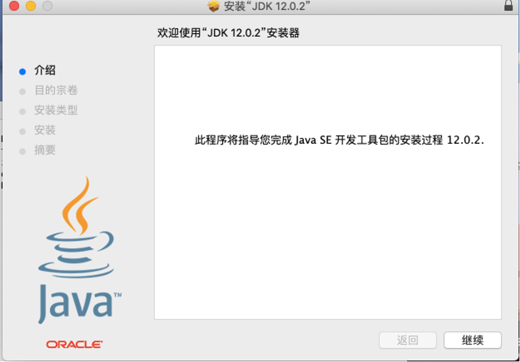
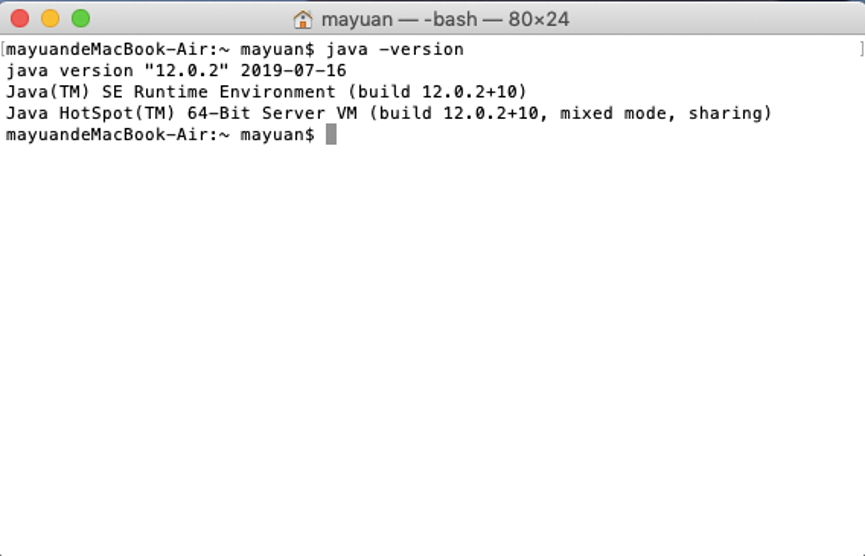
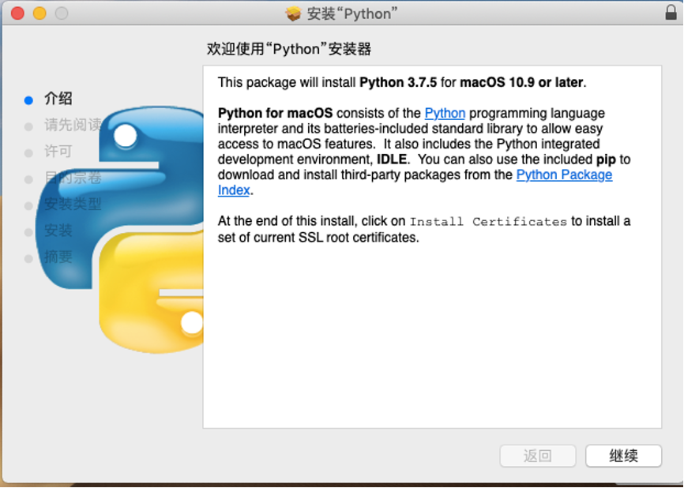
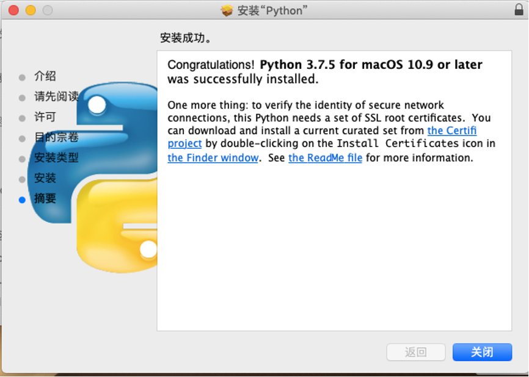
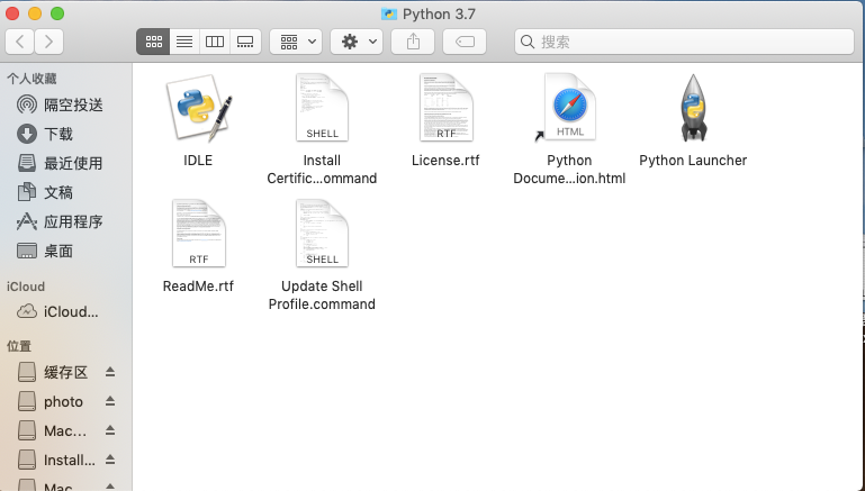
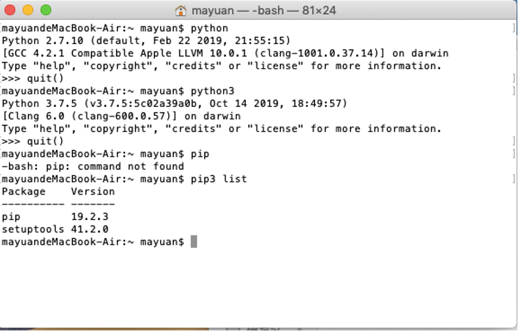
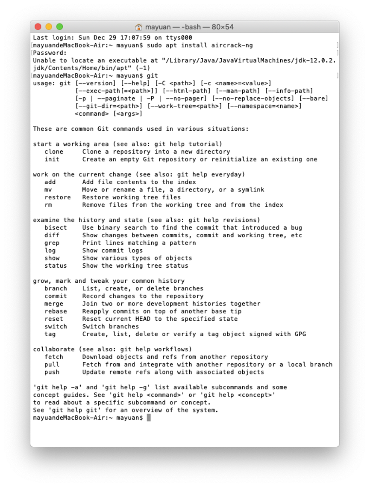
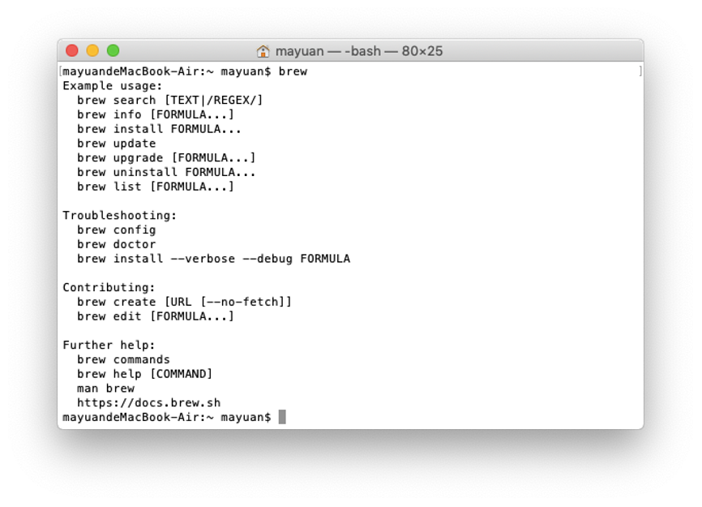
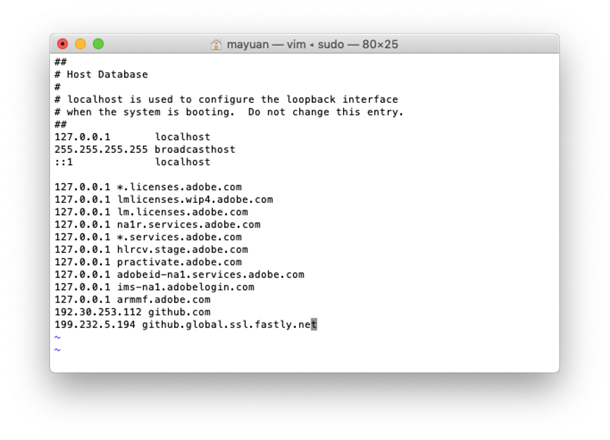
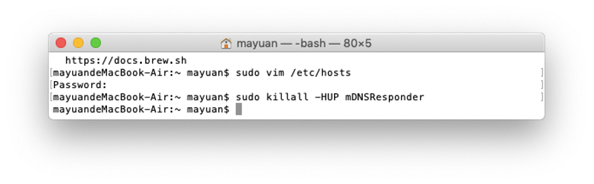

[TOC]

# <a name ="top">目录</a>

## [系统安装](#1)

### [1.1降级过程中遇到的问题](#1.1)

### [1.2如果在安装的过程中，将硬盘格式化了，则需要进行下列修改](#1.2)

### [1.3其他问题](#1.3)

### [1.4目录](#1.4)

### [1.5目录](#1.5)

### [1.6目录](#1.6)

### [1.7目录](#1.7)

### [1.8目录](#1.8)

### [1.9目录](#1.9)

### [1.10目录](#1.10)

## [编程环境安装](#2)

### [2.1C++](#2.1)

### [2.2C](#2.2)

### [2.3Java](#2.3)

### [2.4Python](#2.4)

### [2.5MySQL](#2.5)

### [2.6Git](#2.6)

### [2.7HomeBrew 安装慢的问题](#2.7)

### [2.8GitHub下载慢的问题](#2.8)

### [2.9Pip 下载慢问题](#2.9)

### [2.10macport](#2.10)

## [软件安装](#3)

### [3.1目录](#3.1)

### [3.2目录](#3.2)

### [3.3目录](#3.3)

### [3.4目录](#3.4)

### [3.5目录](#3.5)

### [3.6目录](#3.6)

### [3.7目录](#3.7)

### [3.8目录](#3.8)

### [3.9目录](#3.9)

### [3.10目录](#3.10)

## [4目录](#4)

### [4.1目录](#4.1)

### [4.2目录](#4.2)

### [4.3目录](#4.3)

### [4.4目录](#4.4)

### [4.5目录](#4.5)

### [4.6目录](#4.6)

### [4.7目录](#4.7)

### [4.8目录](#4.8)

### [4.9目录](#4.9)

### [4.10目录](#4.10)

## [5目录](#5)

### [5.1目录](#5.1)

### [5.2目录](#5.2)

### [5.3目录](#5.3)

### [5.4目录](#5.4)

### [5.5目录](#5.5)

### [5.6目录](#5.6)

### [5.7目录](#5.7)

### [5.8目录](#5.8)

### [5.9目录](#5.9)

### [5.10目录](#5.10)

## [6目录](#6)

### [6.1目录](#6.1)

### [6.2目录](#6.2)

### [6.3目录](#6.3)

### [6.4目录](#6.4)

### [6.5目录](#6.5)

### [6.6目录](#6.6)

### [6.7目录](#6.7)

### [6.8目录](#6.8)

### [6.9目录](#6.9)

### [6.10目录](#6.10)

## [7目录](#7)

### [7.1目录](#7.1)

### [7.2目录](#7.2)

### [7.3目录](#7.3)

### [7.4目录](#7.4)

### [7.5目录](#7.5)

### [7.6目录](#7.6)

### [7.7目录](#7.7)

### [7.8目录](#7.8)

### [7.9目录](#7.9)

### [7.10目录](#7.10)

## [8目录](#8)

### [8.1目录](#8.1)

### [8.2目录](#8.2)

### [8.3目录](#8.3)

### [8.4目录](#8.4)

### [8.5目录](#8.5)

### [8.6目录](#8.6)

### [8.7目录](#8.7)

### [8.8目录](#8.8)

### [8.9目录](#8.9)

### [8.10目录](#8.10)

## [9目录](#9)

### [9.1目录](#9.1)

### [9.2目录](#9.2)

### [9.3目录](#9.3)

### [9.4目录](#9.4)

### [9.5目录](#9.5)

### [9.6目录](#9.6)

### [9.7目录](#9.7)

### [9.8目录](#9.8)

### [9.9目录](#9.9)

### [9.10目录](#9.10)

## [10目录](#10)

### [10.1目录](#10.1)

### [10.2目录](#10.2)

### [10.3目录](#10.3)

### [10.4目录](#10.4)

### [10.5目录](#10.5)

### [10.6目录](#10.6)

### [10.7目录](#10.7)

### [10.8目录](#10.8)

### [10.9目录](#10.9)

### [10.10目录](#10.10)

# <a name ="2">内容</a>

[🔝](#top)

## <a name ="1">系统安装</a>

[🔝](#top)

### <a name ="1.1">降级过程中遇到的问题</a>

按住option，选择需要启动的U盘，之后进入实用工具

重装系统时，显示安装包已经坏了，解决办法，修改时间，打开终端，输入

`date 010101012015.30`

 注意只需要改到2015年，即可以安装Mojave，时间为月日时分年秒

[🔝](#top)

### <a name ="1.2">如果在安装的过程中，将硬盘格式化了，则需要进行下列修改</a>

开机按住command+R

连接网络，等待小地球转动，直到进入到实用工具

连接网络重新安装系统

直到安装好

[🔝](#top)

### <a name ="1.3">其他问题</a>

磁盘格式化问题，10.14以后要格式化成APFS

10.14之前普通的MacOS 扩展

硬盘显示在侧边栏 显示路径

触控板右键

[🔝](#top)

### <a name ="1.4">1.4内容</a>

[🔝](#top)

### <a name ="1.5">1.5内容</a>

[🔝](#top)

### <a name ="1.6">1.6内容</a>

[🔝](#top)

### <a name ="1.7">1.7内容</a>

[🔝](#top)

### <a name ="1.8">1.8内容</a>

[🔝](#top)

### <a name ="1.9">1.9内容</a>

[🔝](#top)

### <a name ="1.10">1.10内容</a>

[🔝](#top)

## <a name ="2"> 安装编程环境</a>

[🔝](#top)

### <a name ="2.1">C++</a>

[🔝](#top)

### <a name ="2.2">C</a>

C++ C 直接下载xcode后，完美集成以上两种语言的环境

[🔝](#top)

### <a name ="2.3">JAVA</a>

JDK>JRE>JVM JDK里包含了所有Java开发的包，不需要再重新下载别的其他文件 



验证安装成功：



javac验证 用法: javac <options> <source files>

[🔝](#top)

### <a name ="2.4">Python</a>

Python python-3.7.5-macosx10.9 







测试安装是否成功：




[🔝](#top)

### <a name ="2.5">SQL</a>

SQL 数据库 mysql-cluster-8.0.14-dmr-macos10.14-x86_64

[🔝](#top)

### <a name ="2.6">Git</a>



Git 指令  Xcode 里自带Git（应该是）,或者单独去官网安装

[🔝](#top)

### <a name ="2.7">**HomeBrew**</a>

一款下载工具  [安装教程](https://brew.sh/index_zh-cn) 

安装指令

```sh
/usr/bin/ruby -e "$(curl -fsSL https://raw.githubusercontent.com/Homebrew/install/master/install)"
```

验证安装成功 


[🔝](#top)

### <a name ="2.8">**解决GitHub下载慢的问题**</a>

[方案](https://blog.csdn.net/qq_33144323/article/details/100592325)





[🔝](#top)

### <a name ="2.9">pip 下载慢解决</a>

[地址](https://blog.csdn.net/qq_38161040/article/details/100674939)

使用 vim编辑更改文件

更改至国内镜像源，阿里或者清华镜像

[🔝](#top)

### <a name ="2.10">cocopad</a>

[下载](https://juejin.im/entry/6844903731008536590)

[🔝](#top)

## <a name ="3">软件</a>

[🔝](#top)

### <a name ="3.1">必要软件清单</a>

###### 1>office全家桶 Office_16.17.18090901_Installer

###### 2>Adobe全家桶必须要安装的

Adobe Acrobat //PDF阅读器

Photoshop   //图片修改

3> 

######     Chrome 登录谷歌账号，将必要插件安装上以后，重新安装油猴插件，油猴插件主要包含了百度谷歌和CSDN GitHub排版，阅读模式，网页复制粘贴限制，视频播放优化，快进倍速

######     HandShake //安卓文件传输软件

######     Android File Transfer //安卓传输文件，由谷歌开发，相对来说比较稳定

######     Pycharm //开发Python必须软件

######     ShadowSock 科学上网

​    网易云音乐

​    百度网盘

​    VSCode 下载必要的代码格式，轻度开发

[paste粘贴板软件]( https://apps.apple.com/cn/app/paste-clipboard-tool/id1554034946?mt=12)

[🔝](#top)

### <a name ="3.2">3.2内容</a>

[🔝](#top)

### <a name ="3.3">3.3内容</a>

[🔝](#top)

### <a name ="3.4">3.4内容</a>

[🔝](#top)

### <a name ="3.5">3.5内容</a>

[🔝](#top)

### <a name ="3.6">3.6内容</a>

[🔝](#top)

### <a name ="3.7">3.7内容</a>

[🔝](#top)

### <a name ="3.8">3.8内容</a>

[🔝](#top)

### <a name ="3.9">3.9内容</a>

[🔝](#top)

### <a name ="3.10">3.10内容</a>

[🔝](#top)

## <a name ="4">4内容</a>

[🔝](#top)

### <a name ="4.1">4.1内容</a>

[🔝](#top)

### <a name ="4.2">4.2内容</a>

[🔝](#top)

### <a name ="4.3">4.3内容</a>

[🔝](#top)

### <a name ="4.4">4.4内容</a>

[🔝](#top)

### <a name ="4.5">4.5内容</a>

[🔝](#top)

### <a name ="4.6">4.6内容</a>

[🔝](#top)

### <a name ="4.7">4.7内容</a>

[🔝](#top)

### <a name ="4.8">4.8内容</a>

[🔝](#top)

### <a name ="4.9">4.9内容</a>

[🔝](#top)

### <a name ="4.10">4.10内容</a>

[🔝](#top)

## <a name ="5">5内容</a>

[🔝](#top)

### <a name ="5.1">5.1内容</a>

[🔝](#top)

### <a name ="5.2">5.2内容</a>

[🔝](#top)

### <a name ="5.3">5.3内容</a>

[🔝](#top)

### <a name ="5.4">5.4内容</a>

[🔝](#top)

### <a name ="5.5">5.5内容</a>

[🔝](#top)

### <a name ="5.6">5.6内容</a>

[🔝](#top)

### <a name ="5.7">5.7内容</a>

[🔝](#top)

### <a name ="5.8">5.8内容</a>

[🔝](#top)

### <a name ="5.9">5.9内容</a>

[🔝](#top)

### <a name ="5.10">5.10内容</a>

[🔝](#top)

## <a name ="6">6内容</a>

[🔝](#top)

### <a name ="6.1">6.1内容</a>

[🔝](#top)

### <a name ="6.2">6.2内容</a>

[🔝](#top)

### <a name ="6.3">6.3内容</a>

[🔝](#top)

### <a name ="6.4">6.4内容</a>

[🔝](#top)

### <a name ="6.5">6.5内容</a>

[🔝](#top)

### <a name ="6.6">6.6内容</a>

[🔝](#top)

### <a name ="6.7">6.7内容</a>

[🔝](#top)

### <a name ="6.8">6.8内容</a>

[🔝](#top)

### <a name ="6.9">6.9内容</a>

[🔝](#top)

### <a name ="6.10">6.10内容</a>

[🔝](#top)

## <a name ="7">7内容</a>

[🔝](#top)

### <a name ="7.1">7.1内容</a>

[🔝](#top)

### <a name ="7.2">7.2内容</a>

[🔝](#top)

### <a name ="7.3">7.3内容</a>

[🔝](#top)

### <a name ="7.4">7.4内容</a>

[🔝](#top)

### <a name ="7.5">7.5内容</a>

[🔝](#top)

### <a name ="7.6">7.6内容</a>

[🔝](#top)

### <a name ="7.7">7.7内容</a>

[🔝](#top)

### <a name ="7.8">7.8内容</a>

[🔝](#top)

### <a name ="7.9">7.9内容</a>

[🔝](#top)

### <a name ="7.10">7.10内容</a>

[🔝](#top)

## <a name ="8">8内容</a>

[🔝](#top)

### <a name ="8.1">8.1内容</a>

[🔝](#top)

### <a name ="8.2">8.2内容</a>

[🔝](#top)

### <a name ="8.3">8.3内容</a>

[🔝](#top)

### <a name ="8.4">8.4内容</a>

[🔝](#top)

### <a name ="8.5">8.5内容</a>

[🔝](#top)

### <a name ="8.6">8.6内容</a>

[🔝](#top)

### <a name ="8.7">8.7内容</a>

[🔝](#top)

### <a name ="8.8">8.8内容</a>

[🔝](#top)

### <a name ="8.9">8.9内容</a>

[🔝](#top)

### <a name ="8.10">8.10内容</a>

[🔝](#top)

## <a name ="9">9内容</a>

[🔝](#top)

### <a name ="9.1">9.1内容</a>

[🔝](#top)

### <a name ="9.2">9.2内容</a>

[🔝](#top)

### <a name ="9.3">9.3内容</a>

[🔝](#top)

### <a name ="9.4">9.4内容</a>

[🔝](#top)

### <a name ="9.5">9.5内容</a>

[🔝](#top)

### <a name ="9.6">9.6内容</a>

[🔝](#top)

### <a name ="9.7">9.7内容</a>

[🔝](#top)

### <a name ="9.8">9.8内容</a>

[🔝](#top)

### <a name ="9.9">9.9内容</a>

[🔝](#top)

### <a name ="9.10">9.10内容</a>

[🔝](#top)

## <a name ="10">10内容</a>

[🔝](#top)

### <a name ="10.1">10.1内容</a>

[🔝](#top)

### <a name ="10.2">10.2内容</a>

[🔝](#top)

### <a name ="10.3">10.3内容</a>

[🔝](#top)

### <a name ="10.4">10.4内容</a>

[🔝](#top)

### <a name ="10.5">10.5内容</a>

[🔝](#top)

### <a name ="10.6">10.6内容</a>

[🔝](#top)

### <a name ="10.7">10.7内容</a>

[🔝](#top)

### <a name ="10.8">10.8内容</a>

[🔝](#top)

### <a name ="10.9">10.9内容</a>

[🔝](#top)

### <a name ="10.10">10.10内容</a>