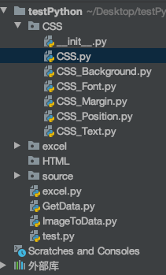

[TOC]

# 目录

## [基础概念](#1)

#### [从另一个文件中引用另外的类函数](#1.1)  [安装2与3共存](#1.2)

## [pip](#2)

#### [解决`python -m pip install --upgrade pip` 报错问题](#2.1)

# 内容

## <a name="1">基础概念</a>

### <a name="1.1">从另一个文件中引用另外的类函数</a>

如图

关系为CSS_Position继承CSS，然后getdata.py要引用CSS__Position这个类

问题出在CSS_Position中，由于getdata.py想要引用 `from CSS.CSS_P import CSSP`

没什么问题，但是CSS_P 在引用CSS.py时，使用了相对路径，使得进一步getdata引用过程中仍然使用相对路径，故出错

应该直接使用`from CSS.CSS import CSS` 这样的绝对路径 [参考](https://blog.csdn.net/sinat_27693393/article/details/70037718)

### <a name="1.2">安装2与3共存</a> (win下)

首先装好2和3，将python27中的python.exe改成python2.exe Python37不变

这样在cmd输入的时候python2即为2，python即为3

直接这样设置变量 set PATH=%PATH%;C:\Python27 

环境变量如图，系统用户均设置

```
D:\PYTHON2
D:\PYTHON2\Scripts
D:\PYTHON3
D:\PYTHON3\Scripts
```

## <a name="2">pip</a>

#### <a name="2.1">解决`python -m pip install --upgrade pip` 报错问题</a>

在安装包的时候提示

`You are using pip version 9.0.3, however version 10.0.1 is available.`

`You should consider upgrading via the 'python -m pip install --upgrade pip' command.`

而我按照要求运行`python -m pip install --upgrade pip` 后仍然无法成功升级，提示如下：

```
(venv) D:\Fish>python -m pip install --upgrade pip

Requirement already up-to-date: pip in d:\fish\venv\lib\site-packages (10.0.1)
```

于是按照要求将`d:\fish\venv\lib\site-packages (10.0.1)` 中的pip-10.0.1.dist-info删除，再次运行python -m pip install --upgrade pip 后升级成功，之前不能安装的包也能安装了！

pip升级错误

`1，使用python -m pip install --upgrade pip升级失败`

`2，使用python -m pip install -U --force-reinstall pip依然失败`

`3，使用pip install --user --upgrade pip成功升级`

国外镜像下载不了

`pip install numpy -i https://pypi.doubanio.com/simple/ --trusted-host [pypi.doubanio.com](http://pypi.doubanio.com/) django`

